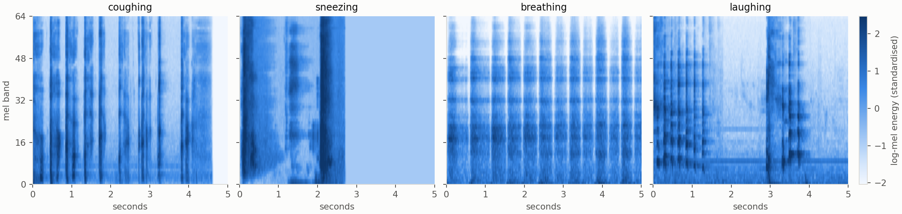
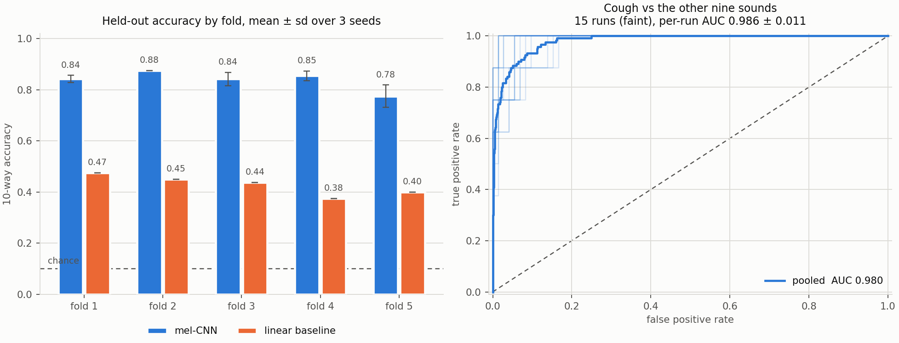
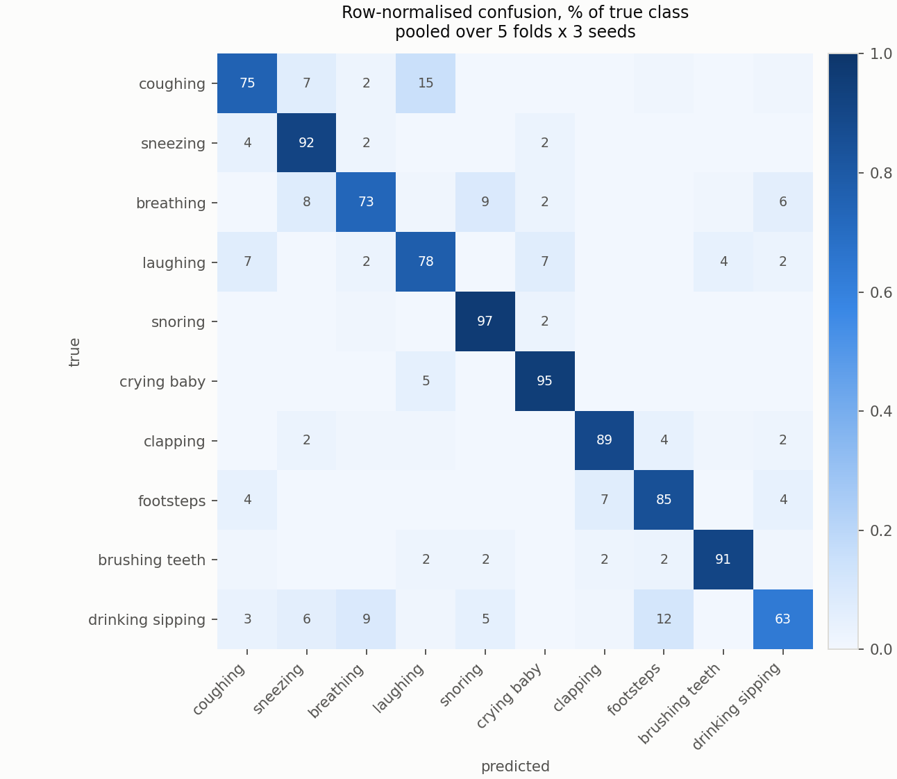
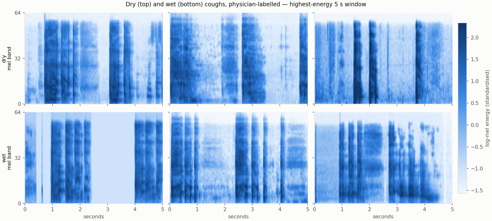
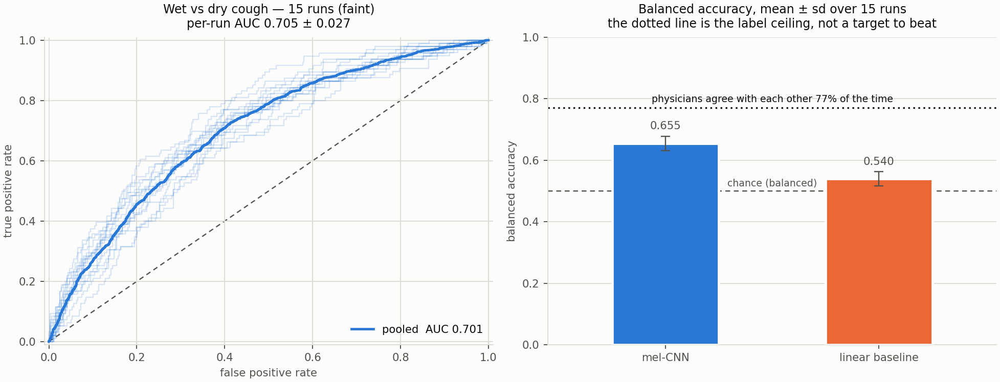

# Cough spectrograms

**Two stages of acoustic cough analysis, measured honestly: is this a cough, and what
kind of cough is it.**

Cough audio has a decade of published results behind it, most of them reported on a
single split of a small dataset. This repository does both tasks on open data, with the
dataset's own folds, three seeds, and every number given as mean ± standard deviation.
The numbers are therefore smaller than the literature's — and you can check them.

---

> ### Source code is not public
>
> The repository holding the code is private. **The source is available for
> technical review under NDA** — contact me through the links at the end of
> this page. This page documents the method and the measured results.

---

---

## Prior work — the clinical studies behind this

Two peer-reviewed studies I co-authored on cough acoustics, both on **proprietary
clinical recordings** collected through the Acoustery system. Their figures are quoted
as reported by those papers. They are **not** this repository's results, and the two
sets of numbers are deliberately kept apart.

**Mitrofanova A.Y., Mikhaylov D., Shaznaev I., Chumanskaia V., Saveliev V.**
*Acoustery System for Differential Diagnosing of Coronavirus COVID-19 Disease.*
IEEE Open Journal of Engineering in Medicine and Biology **2**, 299–303 (2021).
[doi:10.1109/OJEMB.2021.3127078](https://doi.org/10.1109/OJEMB.2021.3127078)
≈3,000 cough recordings from hospitals in Russia, Belarus and Kazakhstan, April–October
2020. CNN encoder with a recurrent network and an attention mechanism.
**Accuracy 85%, precision 78.5%, recall 73%.**

**Dvoryankin S.V., Pavalkis D., Ovsyannikov D.Y., Kulzhanova Sh.A., Tuleshova G.T.,
Mikhaylov D.M. et al.** *Can We Recognize a COVID-19 Cough?*
ISSN 1341-2051, **25**(12), 3967–3973 (2020), with Astana Medical University.
70 participants, 196 cough episodes, acoustic criteria reviewed by a pulmonologist.
**Separation of 56 confirmed against 130 non-acute records at accuracy 1.0.**

Both rest on data that cannot be released. This repository is the open counterpart:
the same family of problems on public datasets, reproducible from a clean clone.

---

## The two stages

| | Question | Data | Result |
|---|---|---|---|
| **Stage 1** | Is this sound a cough? | ESC-50, 400 clips, cough vs 9 confusable human sounds | AUC **0.986 ± 0.011**, 10-way accuracy **0.838 ± 0.041** |
| **Stage 2** | Dry cough or wet cough? | COUGHVID, 2,063 physician-labelled recordings | AUC **0.705 ± 0.027**, balanced accuracy **0.655 ± 0.023** |

The gap between the two stages is the point of the repository. Detecting that a cough
happened is close to solved on clean audio. Saying what *kind* of cough it was is a
different problem, and the honest number for it is much lower — lower than most
published cough-typing results, and lower than the physicians agree with each other.

---

## Stage 1 — is this a cough?

Ten human and respiratory classes from [ESC-50](https://github.com/karolpiczak/ESC-50),
40 clips each, five seconds, 44.1 kHz:

`coughing` · `sneezing` · `breathing` · `laughing` · `snoring` · `crying_baby` ·
`clapping` · `footsteps` · `brushing_teeth` · `drinking_sipping`

These are the right distractors. A cough detector that only has to beat traffic noise
is not being tested. Sneezing shares the explosive onset, breathing shares the airway,
laughing shares the repeated glottal bursts.

Five-fold cross-validation on ESC-50's **official folds**, three seeds — fifteen runs.

| | 10-way accuracy | cough vs rest, AUC |
|---|---|---|
| **mel-CNN** | **0.838 ± 0.041** | **0.986 ± 0.011** |
| Linear baseline (logistic regression on the time-averaged log-mel vector) | 0.428 ± 0.037 | — |
| Chance | 0.100 | 0.500 |

The linear baseline matters. It is 64 numbers per clip — the mel spectrum averaged over
time, every temporal structure destroyed — and it already reaches 0.428. Whatever the
CNN is worth, it is worth the difference between those two rows, not the difference
from chance.

**Cough is the second-hardest class in the set.** It is recalled 75% of the time, and
the errors are not spread evenly: 15% of coughs are called **laughing**, twice as many
as are called sneezing (7%). The confusion is symmetric — 7% of laughs come back as
coughs. That is not the error you would predict: sneezing looks like the obvious
confounder, and it is not. Laughing is a train of short glottal bursts at roughly cough
spacing, and once the mel filterbank has dropped the fine harmonic detail the two are
close neighbours.

Only `drinking_sipping` does worse (63%, mostly lost to footsteps). At the other end
`snoring` (97%) and `crying_baby` (95%) are nearly free — long, periodic, low-frequency,
with nothing else in the set resembling them.

---

## Stage 2 — what kind of cough?

[COUGHVID](https://zenodo.org/records/7024894) (EPFL, CC BY 4.0) is ~34,000 crowdsourced
recordings, of which four physicians labelled a subset for **cough type: dry or wet**,
along with severity, wheezing, stridor and dyspnea. Dry versus wet (productive) is the
first split any clinician makes by ear, and it is the one open label of its kind.

**2,063 recordings** survive the filter — a majority expert label, ties dropped, and the
dataset's own cough detector above 0.8. The split is **1,587 dry / 476 wet**.

| | ROC-AUC | balanced accuracy |
|---|---|---|
| **mel-CNN** | **0.705 ± 0.027** | **0.655 ± 0.023** |
| Linear baseline (time-averaged log-mel) | 0.559 ± 0.025 | 0.540 ± 0.023 |
| Always answer "dry" | 0.500 | 0.500 |
| *Physician vs physician, where they overlapped (n = 565)* | *—* | *0.770* |

**The ceiling is the labels, not the model.** The four physicians overlapped on only 565
judgements, and where they overlapped they agreed **77.0%** of the time — ranging from
67% to 93% depending on the pair. A model cannot cleanly exceed the consistency of the
thing it is fitted to. That number belongs on the chart, and it is why the result here
is reported as ROC-AUC and balanced accuracy rather than accuracy.

**Accuracy would be a lie here.** Always answering "dry" scores 0.769 without listening
to anything, which is roughly the physicians' own agreement rate. Any paper reporting
bare accuracy on an imbalanced cough-type set is reporting the class prior.

---

## Honest limitations

Read these before quoting any number above.

- **Stage 1 is 400 clips.** Forty per class, 320 in training per fold. Small enough that
  the model memorises the training set in a few epochs without augmentation, and small
  enough that a 3-point difference between methods is noise.
- **ESC-50 is not clinical data.** Curated Freesound audio: one cough per clip, clean
  recording, no comorbidity, no microphone variety, no clinician's label. Nothing in
  stage 1 says anything about detecting *disease*.
- **Digital silence is a cue in stage 1.** Several clips contain long stretches of true
  silence around the event, which becomes a flat block in the standardised log-mel
  image. That block is informative and the network is free to use it. A property of the
  dataset, not of coughs.
- **COUGHVID labels are single-rater for most clips.** Only 107 recordings were judged
  by two or more physicians. Almost every training label is one doctor's opinion, and
  the measured 77% pairwise agreement says how much that opinion moves between doctors.
- **COUGHVID is crowdsourced audio.** Phone microphones, uncontrolled rooms, no
  diagnosis confirmed by test for most uploads, and no way to group recordings by
  speaker — if one person uploaded several clips they can land on both sides of a
  split. That would inflate stage 2, not deflate it.
- **Neither stage diagnoses anything.** Dry versus wet is a description of a sound. It
  is not a disease label, and this repository makes no clinical claim.
- **One architecture, no sweep.** The same small CNN runs both stages. A tuned model
  would score better and its reported number would be less trustworthy for exactly the
  reason this README keeps repeating.

---

The mel filterbank is twenty lines of numpy rather than a library call, because the
frame rate, the band count and the frequency ceiling decide what survives into the
image — and those decisions should be visible, not buried in a default argument.

## Related

- [**making-pinns-work**](https://github.com/drdmitrymikhaylov/making-pinns-work) — the same
  reporting discipline applied to physics-informed neural networks: why they fail to
  converge, measured over seeds rather than asserted.
- [**oreforge**](https://github.com/drdmitrymikhaylov/oreforge) — a PINN solver inside a 3D
  ore-body modelling application.

## Data and licences

Code **MIT**. Neither dataset is redistributed here; both are downloaded at setup and
keep their own terms.

- **ESC-50** — CC BY-NC 3.0. K. J. Piczak, *ESC: Dataset for Environmental Sound
  Classification*, ACM Multimedia 2015. The non-commercial term travels with it.
- **COUGHVID** — CC BY 4.0. L. Orlandic, T. Teijeiro, D. Atienza, *The COUGHVID
  crowdsourcing dataset, a corpus for the study of large-scale cough analysis
  algorithms*, Scientific Data 8, 156 (2021).
  [doi:10.1038/s41597-021-00937-4](https://doi.org/10.1038/s41597-021-00937-4)

---

**Prof. Dr. Dmitry Mikhaylov** · Abu Dhabi, UAE
[LinkedIn](https://www.linkedin.com/in/dmitry-mikhaylov) ·
[ORCID](https://orcid.org/0009-0009-2108-6820) ·
[Substack](https://dmitrymikhaylov.substack.com)
