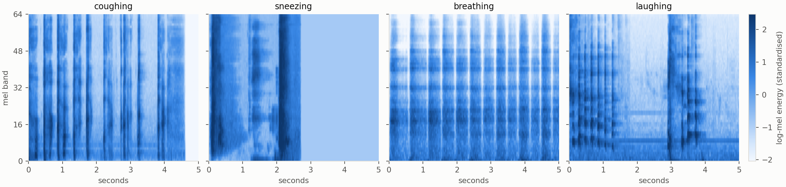
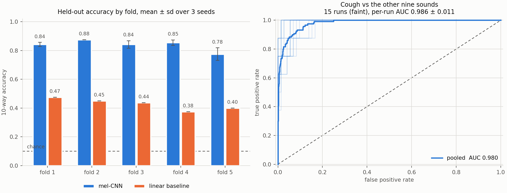
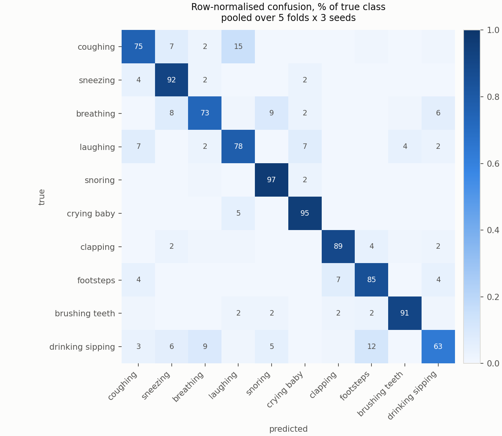
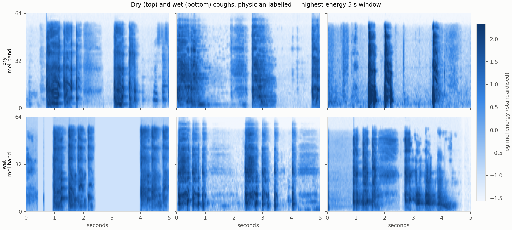
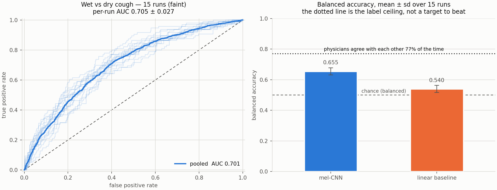

# Cough spectrograms

**Two stages of acoustic cough analysis, measured on open data with the dataset's own
folds: is this a cough, and what kind of cough is it.**

Cough audio has a decade of published results behind it, most of them reported on a
single split of a small dataset. This repository does both tasks on open data, with the
dataset's own folds, three seeds, and every number given as mean ± standard deviation.
The numbers are therefore smaller than the literature's -- and you can check them.

---

> ### Source code is not public
>
> The repository holding the code is private. **The source is available for
> technical review under NDA** -- contact me through the links at the end of
> this page. This page documents the method and the measured results.

---

## The road here

Cough acoustics is one of my longest-running lines of work. During the pandemic my team built a system that told COVID-19 from other respiratory conditions by the sound of a cough, published in *IEEE Open Journal of Engineering in Medicine and Biology* (2021, *Acoustery System for Differential Diagnosing of Coronavirus COVID-19 Disease*) and covered by the press in Asia. The same pipeline went on to clinical and commercial partners. This repository is its open core, retrained on public cough datasets so anyone can reproduce every number.

## Where does this come from?

Two peer-reviewed studies I co-authored on cough acoustics, both on **proprietary
clinical recordings** collected through the Acoustery system. Their figures are quoted
as reported by those papers. They are **not** this repository's results, and the two
sets of numbers are deliberately kept apart.

**Mitrofanova A.Y., Mikhaylov D., Shaznaev I., Chumanskaia V., Saveliev V.**
*Acoustery System for Differential Diagnosing of Coronavirus COVID-19 Disease.*
IEEE Open Journal of Engineering in Medicine and Biology **2**, 299–303 (2021).
[doi:10.1109/OJEMB.2021.3127078](https://doi.org/10.1109/OJEMB.2021.3127078)
About 3,000 cough recordings from hospitals in Russia, Belarus and Kazakhstan, April
to October 2020. CNN encoder with a recurrent network and an attention mechanism.
**Accuracy 85%, precision 78.5%, recall 73%.**

**Dvoryankin S.V., Pavalkis D., Ovsyannikov D.Y., Kulzhanova Sh.A., Tuleshova G.T.,
Mikhaylov D.M. et al.** *Can We Recognize a COVID-19 Cough?*
ISSN 1341-2051, **25**(12), 3967–3973 (2020), with Astana Medical University.
70 participants, 196 cough episodes, acoustic criteria reviewed by a pulmonologist.
**Separation of 56 confirmed against 130 non-acute records at accuracy 1.0.**

Both rest on data that cannot be released. This repository is the open counterpart:
the same family of problems on public datasets, reproducible from a clean clone.

---

## What are the two stages?

| | Question | Data | Result |
|---|---|---|---|
| **Stage 1** | Is this sound a cough? | ESC-50, 400 clips, cough vs 9 confusable human sounds | AUC **0.986 ± 0.011**, 10-way accuracy **0.838 ± 0.041** |
| **Stage 2** | Dry cough or wet cough? | COUGHVID, 2,063 physician-labelled recordings | AUC **0.705 ± 0.027**, balanced accuracy **0.655 ± 0.023** |

The gap between the two stages is the point of the repository. Detecting that a cough
happened is close to solved on clean audio -- as a ranking; what it costs at a
threshold is counted in the next section. Saying what *kind* of cough it was is a
different problem, and the measured number for it is much lower. It is lower than most
published cough-typing results, and lower than the physicians agree with each other.

---

## Is this a cough?

Ten human and respiratory classes from [ESC-50](https://github.com/karolpiczak/ESC-50),
40 clips each, five seconds, 44.1 kHz:

`coughing` · `sneezing` · `breathing` · `laughing` · `snoring` · `crying_baby` ·
`clapping` · `footsteps` · `brushing_teeth` · `drinking_sipping`

These are the right distractors. A cough detector that only has to beat traffic noise
is not being tested. Sneezing shares the explosive onset, breathing shares the airway,
laughing shares the repeated glottal bursts.

Five-fold cross-validation on ESC-50's **official folds**, three seeds -- fifteen runs.

| | 10-way accuracy | cough vs rest, AUC |
|---|---|---|
| **mel-CNN** | **0.838 ± 0.041** | **0.986 ± 0.011** |
| Linear baseline (logistic regression on the time-averaged log-mel vector) | 0.428 ± 0.037 | -- |
| Chance | 0.100 | 0.500 |

The linear baseline matters. It is 64 numbers per clip -- the mel spectrum averaged
over time, every temporal structure destroyed -- and it already reaches 0.428.
Whatever the CNN is worth, it is worth the difference between those two rows, not the
difference from chance.

**Cough is one of the three hardest classes in the set.** It is recalled 75% of the
time, and the errors are not spread evenly. 15% of coughs are called **laughing**, twice
as many as are called sneezing (7%), and 7% of laughs come back as coughs. That is not
the error you would predict: sneezing looks like the obvious confounder. Laughing is a
train of short glottal bursts at roughly cough spacing. Once the mel filterbank has
dropped the fine harmonic detail, the two are close neighbours. How many clips that
reading rests on is counted below.

`drinking_sipping` does worse (63%, lost to footsteps more often than to anything else)
and so does `breathing` (73%). At the other end `snoring` (97%) and `crying_baby` (95%)
are nearly free. They are long, periodic and low-frequency, with nothing else in the set
resembling them.

### Is that 120 predictions or 40 clips?

Every percentage above is a share of 120 predictions: the 40 clips of a class, scored
by three seeds. The seeds are three trainings of one network on the same clips, so they
are not three samples of coughs. `results/stage1_clip_checks.json` reads the same
fifteen runs again with the clip as the unit, and with ESC-50's own metadata for the
recording each clip was cut from (script in the private repository,
`src/stage1_clip_checks.py`; it needs neither audio nor training). Added on
5 October 2026.

**The cough errors are clips, not noise.** Each seed gets exactly 30 of the 40 cough
clips right (95 % interval for 30 of 40: 60–86 %). The 30 wrong predictions fall on 15
clips, and **7 clips are missed by all three seeds** -- 21 of the 30 errors. 25 clips
are right every time. A different seed does not move those seven. Over all ten classes
the three seeds give the same answer on 344 of the 400 clips, and 43 clips are never
classified correctly.

**"Second-hardest" was wrong.** The first version of this page said that only
`drinking_sipping` does worse than cough. The pooled confusion matrix above already
said otherwise:

| Class | Right, of 120 predictions | Right by majority of seeds, of 40 clips | Never right |
|---|---|---|---|
| drinking_sipping | 76 (63 %) | 26 | 9 |
| breathing | 88 (73 %) | 29 | 8 |
| **coughing** | **90 (75 %)** | **32** | **7** |
| laughing | 93 (78 %) | 31 | 5 |
| footsteps | 102 (85 %) | 34 | 5 |

Cough is third from the bottom by predictions and fourth by clips. Breathing, coughing
and laughing sit within three clips of each other (the interval on 32 of 40 is
65–90 %), and forty clips cannot rank them.

**Laughing rather than sneezing: six clips against two.** "15% against 7%" is 18
predictions against 8. By clip, of the seven coughs no seed recognises, five are called
laughing every time and two sneezing every time; by majority of seeds it is six against
two. If the two confusions were equally likely, a gap that large would turn up 45 %
(five against two) or 29 % (six against two) of the time. Three of the five
always-laughing clips also carry near-consecutive Freesound numbers
(87794, 87795, 87799). The dataset lists them as three recordings, but numbers that
close usually mean one upload session, and if so the count is three recordings against
two. The other direction is level: the laughs called cough are 8 predictions on
**3 clips**, and sneezes called cough are 5 predictions on 3 clips. So "laughing, not
sneezing, is the confounder" is what these forty clips suggest. They do not establish
it. The file names of all 15 clips are in the results file for anyone who wants to
listen.

**At a threshold, "close to solved" has a price.** Each seed's held-out cough
probabilities, pooled over the 400 clips, give AUC 0.983, 0.979, 0.978 -- a little
under the 0.986 mean of the per-fold values, because five separately trained models
now share one threshold.

| Operating point | seed 0 | seed 1 | seed 2 |
|---|---|---|---|
| Coughs caught (of 40) before the first false alarm | 12 | 17 | 5 |
| Coughs caught with 3 false alarms in the 360 other clips (0.8 %) | 29 | 28 | 30 |
| Coughs caught with 18 false alarms (5 %) | 36 | 33 | 35 |
| False alarms needed to catch 36 of 40 | 16 | 26 | 20 |
| False alarms needed to catch 38 of 40 | 41 | 31 | 48 |
| False alarms needed to catch all 40 | 41 | 57 | 86 |

Held under one per cent false alarms, the detector finds 28 to 30 coughs of 40. To find
38 it fires on 31 to 48 of the other 360 clips (9–13 %), so even with one cough for
every nine other sounds only **44–55 % of the alarms are coughs**. At that setting the
false alarms come from sneezing first: 35 of the 120 over the three seeds, laughing 31,
drinking 22. Sneezing is the lesser confusion when the network has to name the class,
and the leading one when it only has to say "cough" generously. One clip is 2.5 points
of recall here, so the table is given as counts.

**Seeds move the number less than folds, as in stage 2.** Scored over all 400 clips the
three seeds get 343, 331 and 331 right: 0.838 ± 0.017 across seeds, against ± 0.041
across the fifteen runs. Averaging the three seeds' probabilities gets 345 -- two clips
more than the best single seed.

**What this does not show.** The 400 clips come from 326 source recordings, and
unevenly: the 40 coughs from 39, the 40 sneezes from 40, but the 40 `crying_baby` clips
from 18, one of which supplies seven. ESC-50's folds keep a source on one side of the
split, so nothing leaks, but "95% on `crying_baby`" is a statement about 18 recordings.
The Freesound-number argument is an inference from the metadata, not a check of who
uploaded what. And this is still one architecture on curated clips: the seven coughs it
never recognises are worth hearing before anything is concluded about coughs in
general.

---

## What kind of cough is it?

[COUGHVID](https://zenodo.org/records/7024894) (EPFL, CC BY 4.0) is about 34,000
crowdsourced recordings. Four physicians labelled a subset for **cough type: dry or
wet**, along with severity, wheezing, stridor and dyspnea. Dry versus wet (productive)
is the first split any clinician makes by ear, and it is the one open label of its
kind.

**2,063 recordings** survive the filter -- a majority expert label, ties dropped, and
the dataset's own cough detector above 0.8. The split is **1,587 dry / 476 wet**.

| | ROC-AUC | balanced accuracy |
|---|---|---|
| **mel-CNN** | **0.705 ± 0.027** | **0.655 ± 0.023** |
| Linear baseline (time-averaged log-mel) | 0.559 ± 0.025 | 0.540 ± 0.023 |
| Always answer "dry" | 0.500 | 0.500 |
| *Physician vs physician, where they overlapped (n = 565)* | *--* | *0.770* |

**The ceiling is the labels, not the model.** The four physicians overlapped on only 565
judgements. Where they overlapped they agreed **77.0%** of the time, ranging from 67%
to 93% depending on the pair. A model cannot cleanly exceed the consistency of the
thing it is fitted to. That number belongs on the chart, and it is why the result here
is reported as ROC-AUC and balanced accuracy rather than accuracy.

**Accuracy would be a lie here.** Always answering "dry" scores 0.769 without listening
to anything, which is roughly the physicians' own agreement rate. Any paper reporting
bare accuracy on an imbalanced cough-type set is reporting the class prior.

### What happens when the model has to make a call?

An AUC of 0.705 says nothing about what happens at a threshold.
`results/stage2_operating_points.json` reads the same fifteen runs three more ways
(script in the private repository, `src/operating_point.py`).

**The CNN is ahead of the linear baseline on every one of the 15 fold × seed pairs.**
Paired difference in ROC-AUC on the same fold and seed: **+0.146 ± 0.036** (mean ± sd,
95 % CI ±0.018), worst run +0.077, best +0.217. Per fold the CNN sits between 0.683
(fold 2) and 0.734 (fold 4), the baseline between 0.550 and 0.575. So the gap is
not a lucky split. It is small, but it is everywhere.

**Most of the run-to-run spread is the fold, not the seed.** Pooling each seed's
out-of-fold probabilities over all 2,063 recordings gives AUC 0.706, 0.700, 0.698.
That is **0.701 ± 0.004** across seeds, against ± 0.027 across the fifteen runs.
Retraining changes the number less than which 413 recordings you happen to score.

**At the class-weighted argmax threshold the model over-calls "wet".** Pooled over
the 15 runs it flags **50 %** of recordings as wet when 23 % are: wet recall 0.74,
dry recall 0.57, precision on "wet" 0.34. Two of every three "wet" calls are wrong.

| Dry coughs kept correct (specificity) | Wet coughs caught (sensitivity), mean ± sd over 3 seeds |
|---|---|
| 90 % | **0.26** ± 0.03 |
| 80 % | **0.46** ± 0.00 |
| 70 % | **0.59** ± 0.00 |

Look at the table before imagining a product. If the false-alarm rate on dry coughs
has to stay at 10 %, the model finds one wet cough in four. It only becomes useful as
a *screen* -- high recall, low precision -- which is the opposite of what a
cough-typing claim usually implies.

### How are the numbers checked?

The run-level results are in `results/`: `cv_runs.json` for stage 1 with per-clip
logits, `coughtype_runs.json` for stage 2 with per-recording probabilities.
`tests/test_readme_numbers.py` recomputes every figure quoted on this page from those
files -- the ± values, the 75 % cough recall, the 15 % laughing confusion, the
2,063 / 1,587 / 476 split, the operating points above. `tests/test_stage1_clips.py`
does the same for the clip-level reading of stage 1, from the stored logits; only the
source-recording counts are taken from `results/stage1_clip_checks.json`, because
ESC-50's metadata is not redistributed here. A regenerated results file that no longer
matches the text fails the test. `python -m pytest tests/`.

---

## Limitations

Read these before quoting any number above.

- **Stage 1 is 400 clips from 326 recordings.** Forty per class, 320 in training per fold. Small enough that
  the model memorises the training set in a few epochs without augmentation, and small
  enough that a 3-point difference between methods is noise.
- **ESC-50 is not clinical data.** Curated Freesound audio: one cough per clip, clean
  recording, no comorbidity, no microphone variety, no clinician's label. Nothing in
  stage 1 says anything about detecting *disease*.
- **Digital silence is a cue in stage 1.** Several clips contain long stretches of true
  silence around the event, which becomes a flat block in the standardised log-mel
  image. That block is informative and the network is free to use it. A property of the
  dataset, not of coughs.
- **COUGHVID labels are single-rater for most clips.** Only 107 recordings were judged
  by two or more physicians. Almost every training label is one doctor's opinion, and
  the measured 77% pairwise agreement says how much that opinion moves between doctors.
- **COUGHVID is crowdsourced audio.** Phone microphones, uncontrolled rooms, no
  diagnosis confirmed by test for most uploads, and no way to group recordings by
  speaker. If one person uploaded several clips they can land on both sides of a
  split. That would inflate stage 2, not deflate it.
- **Neither stage diagnoses anything.** Dry versus wet is a description of a sound. It
  is not a disease label, and this repository makes no clinical claim.
- **One architecture, no sweep.** The same small CNN runs both stages. A tuned model
  would score better and its reported number would be less trustworthy for exactly the
  reason this README keeps repeating.

---

## What happened along the way?

Stage 2 was not the first plan. An earlier idea was to follow cough detection with
asthma, but ESC-50 has no asthma and ICBHI 2017 has one asthma patient out of 126.
Dry versus wet on COUGHVID was what remained.

torchaudio would not load on the machine I built this on (an ABI conflict with torch
2.9.1 under Python 3.14). So the mel filterbank is twenty lines of numpy, audio is
read with soundfile, and COUGHVID's webm files go through ffmpeg first. Because
people do not cough in the first second of a phone recording, the loader
takes the five-second window with the highest smoothed energy.

On a laptop GPU stage 1 takes about 41 s per fold, ten minutes in all; stage 2 about
200 s per fold, around 45 minutes. Both training
scripts write one JSON per (seed, fold) and skip finished pairs on restart.
The operating-point reading and the test file that pins every number were added on
17 September 2026, after the first version of this page had gone up without them.
The clip-by-clip reading of stage 1 followed on 5 October 2026 and withdrew one claim:
cough is not the second-hardest class.

---

The frame rate, the band count and the frequency ceiling decide what survives into the
image, and those decisions should be visible, not buried in a default argument. That
is the other reason the mel filterbank is written out by hand.

## What else is related?

- [**making-pinns-work**](https://github.com/drdmitrymikhaylov/making-pinns-work) -- the
  same way of reporting applied to physics-informed neural networks: why they fail to
  converge, measured over seeds rather than asserted.
- [**navierpinn-mineral-ore-body-reconstruction**](https://github.com/drdmitrymikhaylov/navierpinn-mineral-ore-body-reconstruction) -- a PINN solver inside
  a 3D ore-body modelling application.

## Which data and licences apply?

Code **MIT**. Neither dataset is redistributed here; both are downloaded at setup and
keep their own terms.

- **ESC-50** -- CC BY-NC 3.0. K. J. Piczak, *ESC: Dataset for Environmental Sound
  Classification*, ACM Multimedia 2015. The non-commercial term travels with it.
- **COUGHVID** -- CC BY 4.0. L. Orlandic, T. Teijeiro, D. Atienza, *The COUGHVID
  crowdsourcing dataset, a corpus for the study of large-scale cough analysis
  algorithms*, Scientific Data 8, 156 (2021).
  [doi:10.1038/s41597-021-00937-4](https://doi.org/10.1038/s41597-021-00937-4)

---

**Prof. Dr. Dmitry Mikhaylov** · Abu Dhabi, UAE
[LinkedIn](https://www.linkedin.com/in/dmitry-mikhaylov) ·
[ORCID](https://orcid.org/0009-0009-2108-6820) ·
[Substack](https://dmitrymikhaylov.substack.com)
